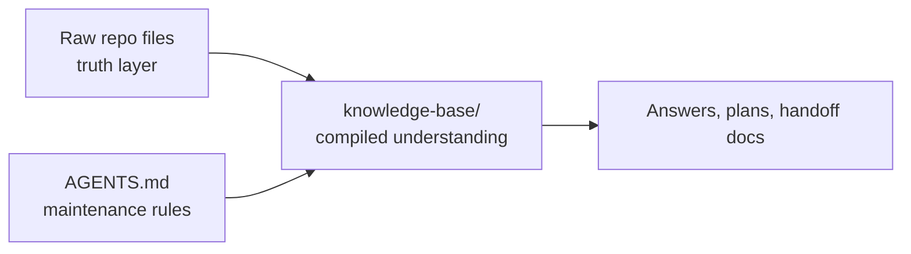

## Working Style

- Explain architecture with graphs and visuals.
- Use non-technical English first, then add the technical term in brackets when it matters.
- Think in logic first. Code is how the logic becomes real.
- When a task changes shape mid-way, note what shifted and why.

## Knowledge Base Mission

This repository uses a three-layer knowledge-base pattern:

1. Raw sources
   - The repo files are the truth layer.
   - Main source areas:
   - `README.md`
   - `SKILL.md`
   - `package.json`
   - `.gitignore`
   - `docs/`
   - `docs/proving-ground/`
   - `cli/`
   - `sdk/`
   - `scripts/`
   - `tests/`
   - `website/`
   - `proving-ground/`
2. Wiki
   - The maintained knowledge base lives in `knowledge-base/`.
   - This layer is for summaries, maps, comparisons, and cross-links.
   - Do not copy large chunks from raw sources into the wiki.
3. Schema
   - This file is the operating manual for how the wiki is maintained.



## Folder Contract

The wiki should keep these anchor files healthy:

- `knowledge-base/index.md`
- `knowledge-base/log.md`
- `knowledge-base/overview.md`
- `knowledge-base/maps/`
- `knowledge-base/surfaces/`
- `knowledge-base/workflows/`
- `knowledge-base/sources/`

## Page Rules

- Every wiki page should use YAML frontmatter.
- Every wiki page should say which raw files it was built from.
- Prefer short pages with links over one giant page.
- Prefer simple diagrams for system shape and flow.
- Write for a smart non-specialist first.
- Keep claims tied to source files. If a claim is uncertain, mark it as provisional.

Recommended frontmatter shape:

```yaml
---
title: Short page title
type: overview | map | surface | workflow | source | index | log
status: active | provisional | stale
updated: YYYY-MM-DD
source_paths:
  - relative/path.md
tags:
  - short-tag
---
```

## Operating Modes

### Ingest

When an important repo surface changes:

1. Read the changed raw files.
2. Update the relevant wiki pages.
3. Add or fix cross-links.
4. Update `knowledge-base/index.md` if pages were added, renamed, or reframed.
5. Append an entry to `knowledge-base/log.md`.

### Query

When answering repo questions:

1. Read `knowledge-base/index.md` first.
2. Read the smallest useful wiki pages next.
3. Only drill into raw files where the wiki is thin, stale, or missing evidence.
4. If the answer creates lasting value, file it back into the wiki as a new or updated page.

### Lint

Periodically check the wiki for:

- stale summaries
- broken or missing cross-links
- pages with no clear source basis
- contradictions between pages
- important repo areas that have no page yet

## Daily Refresh Rule

The daily refresh should:

1. Review meaningful repo changes since the last log entry.
2. Refresh affected wiki pages in `knowledge-base/`.
3. Tighten links between related pages.
4. Update `knowledge-base/index.md` when navigation changed.
5. Append one dated entry to `knowledge-base/log.md`.

If nothing meaningful changed, do a lint pass instead of rewriting pages without reason.

## Guardrails

- Raw repo files stay the source of truth.
- The wiki is allowed to summarize, compare, and synthesize, but not invent.
- Prefer durable maps over chat-only explanations.
- When the repo and wiki disagree, trust the repo, then repair the wiki.
- Treat `proving-ground/reports/` as generated local evidence, not as durable source content.
