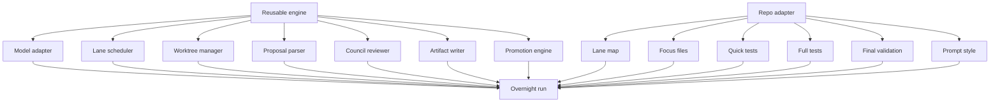
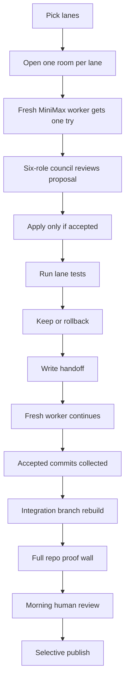

# Overnight Research Module

Draft for Oracle review.

This file is the full context dump for the overnight research system we have been building inside Pandora.

The goal is simple:

- we want a machine that can explore safe improvements overnight
- we want every proposal to be isolated, reviewable, and reversible
- we want the morning workflow to be about judgment, not chaos
- we want to make this reusable in other repos

What we need to have is one reusable overnight improvement factory `(baton-based repo improvement system)`, not a one-off Pandora experiment.

---

## 1. Plain-English Summary

The system works like a relay race.

One worker goes into one room, studies one part of the repo, makes one improvement attempt, gets reviewed, runs tests, writes a handoff, and leaves.

Then a fresh worker comes in and continues from the handoff instead of carrying stale context forever.

```mermaid
flowchart LR
A["Repo is clean"] --> B["Split repo into lanes"]
B --> C["Give each lane its own room (worktree)"]
C --> D["Fresh MiniMax worker gets one try"]
D --> E["Council of Six reviews proposal"]
E --> F["If accepted, apply change in that room"]
F --> G["Run lane tests"]
G --> H["Keep or rollback"]
H --> I["Write handoff and receipts"]
I --> J["Next fresh worker continues"]
J --> K["Accepted commits fan into one integration branch"]
K --> L["Run full repo validation"]
L --> M["Human review and selective publish"]
```



That is the heart of the machine.

---

## 2. Why We Rebuilt It

The older loop had a real weakness:

- it loaded section context once
- it kept asking the same model for more ideas
- context got stale
- proposal quality degraded
- we got too many low-signal or malformed ideas

What we need to have is fresh judgment `(single-attempt worker epochs)`, not a tired model staring at the same frozen packet all night.

The baton model fixes that by changing the shape of the work:

- one worker
- one try
- one review
- one handoff
- fresh worker next

---

## 3. Current Truth In This Repo

This section is the exact map of what already exists in code today.

### Main entrypoints

- `npm run proving-ground:autoresearch:cli:baton`
- `npm run proving-ground:autoresearch:cli:baton:validate`

These scripts are defined in [`package.json`](../../package.json).

```json
{
  "proving-ground:autoresearch:cli:baton": "node scripts/run_cli_baton_autoresearch.cjs start",
  "proving-ground:autoresearch:cli:baton:validate": "node scripts/run_cli_baton_autoresearch.cjs validate"
}
```

### Main files

| File | Role |
|---|---|
| `scripts/run_cli_baton_autoresearch.cjs` | operator CLI for starting, inspecting, pausing, resuming, promoting, and cleaning batches |
| `proving-ground/config/cli_section_research.cjs` | repo-specific lane map, model config, validation commands, worker rules, council rules |
| `proving-ground/lib/cli_baton_autoresearch.cjs` | main control plane |
| `proving-ground/lib/cli_section_autoresearch.cjs` | old section research utilities that still provide prompt building, parsing, and decision logic |
| `proving-ground/lib/minimax_client.cjs` | MiniMax API client |
| `proving-ground/lib/baton_council.cjs` | six-role proposal review gate |
| `proving-ground/lib/baton_manifest.cjs` | batch manifest, lane state, lock-protected updates |
| `proving-ground/lib/baton_worktree_manager.cjs` | worktree create/reuse/remove helpers |
| `proving-ground/lib/change_set_engine.cjs` | structured code mutation engine |
| `proving-ground/lib/autoresearch_loop.cjs` | validation and commit helpers |
| `tests/unit/cli_baton_autoresearch.test.cjs` | system-level synthetic proofs |
| `tests/unit/baton_manifest.test.cjs` | manifest atomicity proof |
| `tests/unit/baton_council.test.cjs` | council behavior proof |

---

## 4. The Current Pandora-Specific Setup

This repo is already wired for MiniMax and ten parallel lanes.

From [`proving-ground/config/cli_section_research.cjs`](../../proving-ground/config/cli_section_research.cjs):

```js
model: {
  provider: 'minimax',
  apiKeyEnv: 'MINIMAX_API_KEY',
  model: 'MiniMax-M2.7-highspeed',
  baseUrl: 'https://api.minimax.io/v1',
  temperature: 0.2,
  reasoningSplit: true,
  timeoutMs: 120000,
  maxAttempts: 3,
  retryDelayMs: 3000,
},
baton: {
  reportDir: 'proving-ground/reports/baton',
  laneCount: 10,
  maxParallelWorkers: 10,
  heartbeatTimeoutMs: 30000,
  cleanupPolicy: 'manual',
  pausePollMs: 250,
},
worker: {
  timeBudgetMs: 1800000,
  tokenBudget: 120000,
  oneAttempt: true,
  maxModelCalls: 1,
  promptVersion: 'baton-v1',
},
council: {
  roles: [
    'correctness',
    'determinism',
    'safety',
    'performance',
    'simplicity',
    'goal-fit',
  ],
  quorum: 4,
  reviseCap: 1,
  dedupe: true,
}
```

That means:

- model = MiniMax
- parallel rooms = 10
- one worker gets one model call
- every proposal must pass a six-role review gate

### The ten Pandora lanes

Pandora currently splits the CLI into ten improvement lanes:

1. onboarding and contracts
2. policy, profiles, and recipes
3. markets, liquidity, and lifecycle
4. mirror deploy and lifecycle
5. Pandora mirroring mode
6. Polymarket hedge mode
7. Polymarket ops and funding
8. operations, risk, and watch
9. sports, models, and streams
10. agent, MCP, bridge, arb, and simulation

Each lane has:

- a title
- command families
- focus files
- help snapshots
- quick validation commands
- full validation commands

This is how the system knows what “one part of the repo” means.

---

## 5. Start-To-End Flow

This is the actual end-to-end shape of the current system.

### Step 1. Load config and verify coverage

What we need to have is a map of the repo before we let the model touch anything `(lane configuration + command coverage)`.

The control plane loads the config and confirms every command is assigned to some lane.

From [`proving-ground/lib/cli_baton_autoresearch.cjs`](../../proving-ground/lib/cli_baton_autoresearch.cjs):

```js
const commandDescriptors = readCommandDescriptors(cwd, config.commandDescriptorPath);
const coverage = buildSectionCoverage(commandDescriptors, config.sections);
if (coverage.uncoveredCommands.length > 0) {
  throw new Error(`CLI section coverage is incomplete. Uncovered commands: ${coverage.uncoveredCommands.join(', ')}`);
}
```

Meaning in plain English:

- if some commands are not owned by a lane
- the overnight loop refuses to start

That is good. It stops silent blind spots.

### Step 2. Create the batch manifest

What we need to have is one notebook that tracks the whole overnight run `(batch manifest)`.

The manifest records:

- batch id
- repo root
- goal
- base commit
- lane list
- worktree paths
- accepted commits
- integration branch state

From [`proving-ground/lib/baton_manifest.cjs`](../../proving-ground/lib/baton_manifest.cjs):

```js
function createBatchManifest(options) {
  return {
    schemaVersion: BATON_MANIFEST_SCHEMA_VERSION,
    batchId: options.batchId,
    createdAt: nowIso(),
    updatedAt: nowIso(),
    repoRoot: options.repoRoot,
    goal: options.goal,
    baseCommit: options.baseCommit,
    paused: false,
    integration: {
      branchName: options.integration && options.integration.branchName,
      worktreePath: options.integration && options.integration.worktreePath,
      status: 'pending',
      latestCommit: null,
      lastError: null,
      promotedAt: null,
      validation: null,
    },
    lanes: options.lanes.map((lane) => createLaneRecord(lane)),
  };
}
```

Meaning in plain English:

- the whole batch has one source of truth
- every lane writes into that source of truth
- we can inspect the run at any time

### Step 3. Create one isolated room per lane

What we need to have is one safe room per worker `(git worktree)`, so one lane cannot step on another lane’s changes.

From [`proving-ground/lib/baton_worktree_manager.cjs`](../../proving-ground/lib/baton_worktree_manager.cjs):

```js
function createWorktree(repoRoot, options) {
  const worktreePath = path.resolve(options.worktreePath);
  const branchName = normalizeText(options.branchName);
  const startPoint = normalizeText(options.startPoint) || 'HEAD';
  ensureDir(path.dirname(worktreePath));
  if (fs.existsSync(worktreePath)) {
    throw new Error(`Worktree path already exists: ${worktreePath}`);
  }
  const args = ['worktree', 'add', '-b', branchName, worktreePath, startPoint];
  const result = runGit(repoRoot, args);
  assertGitOk(result, `git ${args.join(' ')}`);
  ensureSharedNodeModules(repoRoot, worktreePath);
}
```

Important detail:

- each worktree gets a shared `node_modules` symlink
- that keeps the rooms lighter and faster

### Step 4. Give the worker the repo slice and the rules

What we need to have is a narrow, disciplined prompt `(lane-scoped worker prompt)`, not a vague “improve everything” instruction.

The worker prompt is built from:

- lane description
- baseline validation
- help snapshots
- focus file excerpts
- previous handoff
- one-attempt-only rules

From [`proving-ground/lib/cli_baton_autoresearch.cjs`](../../proving-ground/lib/cli_baton_autoresearch.cjs):

```js
function buildWorkerPrompt(section, baseline, helpContext, focusFiles, previousHandoff, workerConfig) {
  const prompt = buildSectionPrompt({
    goal: `Make this CLI section clearer, faster, or simpler with one bounded change. Prompt version: ${workerConfig.promptVersion}.`,
    section,
    baseline,
    helpContext,
    focusFiles,
  });
  const batonAddon = {
    oneAttemptOnly: true,
    previousHandoff: previousHandoff || null,
    stopRules: [
      'You have one proposal attempt only.',
      'If the code you need is not visible, return an empty changeSet.',
      'Do not propose files outside the lane scope.',
    ],
  };
  return {
    systemPrompt: prompt.systemPrompt,
    userPrompt: `${prompt.userPrompt}\n\n${JSON.stringify(batonAddon, null, 2)}`,
  };
}
```

And the core section prompt from [`proving-ground/lib/cli_section_autoresearch.cjs`](../../proving-ground/lib/cli_section_autoresearch.cjs):

```js
systemPrompt: [
  'You are the Pandora CLI improvement researcher.',
  'Return JSON only.',
  'Make one bounded change for the target CLI section.',
  'Improve clarity, speed, or simplicity without changing behavior and without adding benchmark-only logic.',
  'Allowed changeSet operations: replace_once, insert_after_once, insert_before_once.',
  'Only touch the listed focus files.',
].join(' ')
```

Meaning in plain English:

- the model is not asked to “rewrite the system”
- it is asked to make one bounded move
- if it cannot see enough code, it must return no change

### Step 5. Call MiniMax

What we need to have is a thin model adapter `(MiniMax client)`, not model-specific logic spread all over the system.

From [`proving-ground/lib/minimax_client.cjs`](../../proving-ground/lib/minimax_client.cjs):

```js
async function callMinimaxChat(options = {}) {
  const config = resolveMinimaxConfig(options, options.env);
  if (!config.apiKey) {
    throw new Error(`MiniMax API key not found. Set ${config.apiKeyEnv} before running the proving ground.`);
  }
  const requestBody = buildMinimaxRequest({ ...options, env: options.env });
  const response = await fetchImpl(`${config.baseUrl}/chat/completions`, {
    method: 'POST',
    headers: {
      'content-type': 'application/json',
      authorization: `Bearer ${config.apiKey}`,
    },
    body: JSON.stringify(requestBody),
  });
  ...
}
```

Meaning in plain English:

- the worker only knows “ask the research model”
- the transport details live in one place

### Step 6. Parse proposal or fail safely

What we need to have is hard format discipline `(JSON-only proposal contract)`.

If MiniMax returns bad JSON, the system does not crash. It turns that into a safe rejected artifact.

From [`proving-ground/lib/cli_section_autoresearch.cjs`](../../proving-ground/lib/cli_section_autoresearch.cjs):

```js
function buildInvalidProposalFallback(message) {
  return {
    hypothesisId: 'invalid-proposal',
    summary: 'MiniMax returned an invalid proposal and the loop discarded it safely.',
    why: normalizeText(message),
    targetFiles: [],
    expectedImpact: { clarity: '', speed: '', simplicity: '' },
    validationNotes: [
      'Tighten the response format or the prompt before the next mutation run.',
    ],
    changeSet: [],
  };
}
```

Meaning in plain English:

- broken model output becomes evidence
- broken model output does not become broken code

### Step 7. Send the proposal to the Council of Six

What we need to have is six different kinds of criticism `(role-based review council)`, not one generic thumbs-up.

Current six roles:

1. correctness
2. determinism
3. safety
4. performance
5. simplicity
6. goal-fit

From [`proving-ground/lib/baton_council.cjs`](../../proving-ground/lib/baton_council.cjs):

```js
const DEFAULT_REVIEWER_ROLES = Object.freeze([
  'correctness',
  'determinism',
  'safety',
  'performance',
  'simplicity',
  'goal-fit',
]);

const VETO_ROLES = new Set(['correctness', 'determinism', 'safety']);
```

Aggregation logic:

```js
if (duplicateOnly || hardBlockers.length > 0 || rejectCount >= 2) {
  outcome = 'reject';
} else if (acceptCount >= quorum) {
  outcome = 'accept';
} else if (reviseCount > 0) {
  outcome = 'revise';
} else if (acceptCount === 0) {
  outcome = 'reject';
}
```

Meaning in plain English:

- safety, determinism, and correctness can veto
- four accepts are enough if there is no veto
- low-signal duplicates are rejected

Important current truth:

The in-code council is real and automated.

But it is still model review inside the system, not the full human/Codex morning review flow we later perform manually.

That distinction matters.

### Step 8. Refuse out-of-lane edits

What we need to have is room discipline `(scope gate)`.

From [`proving-ground/lib/cli_baton_autoresearch.cjs`](../../proving-ground/lib/cli_baton_autoresearch.cjs):

```js
function validateProposalScope(proposal, section) {
  const allowed = new Set((section.focusFiles || []).map((filePath) => normalizeText(filePath)));
  const touched = Array.isArray(proposal.changeSet)
    ? proposal.changeSet.map((operation) => normalizeText(operation.path)).filter(Boolean)
    : [];
  const invalid = touched.filter((filePath) => !allowed.has(filePath));
  if (invalid.length > 0) {
    throw new Error(`Proposal touches files outside the lane scope: ${invalid.join(', ')}`);
  }
}
```

Meaning in plain English:

- a lane can only touch its own files
- if it tries to touch another lane’s files, the attempt fails

### Step 9. Apply the change in the lane room

What we need to have is a reversible edit format `(structured change set)`.

The system only allows structured operations like:

- `replace_once`
- `insert_after_once`
- `insert_before_once`

That keeps the mutation engine narrow and rollback-friendly.

### Step 10. Run lane validation

What we need to have is proof before promotion `(quick gate + full gate)`.

The worker runs:

- lane quick validation
- optional lane full validation if the quick result looks promising

Then it decides whether the change is worth keeping.

From [`proving-ground/lib/cli_section_autoresearch.cjs`](../../proving-ground/lib/cli_section_autoresearch.cjs):

```js
const keep = noRegression && acceptableSpeed && (
  improvedSpeed
  || simplificationSignal
  || (section.allowNeutralKeep && compactSignal)
);
```

Meaning in plain English:

- no regressions
- no bad slowdown
- and some sign that the change is actually useful

### Step 11. Commit or rollback

What we need to have is a yes-or-no outcome `(kept vs discarded)`.

If the lane change passes:

- it gets committed in the lane branch

If it fails:

- the system rolls back the change set

### Step 12. Write the handoff

What we need to have is a baton receipt `(handoff file)`, so the next worker starts from truth instead of memory.

From [`proving-ground/lib/cli_baton_autoresearch.cjs`](../../proving-ground/lib/cli_baton_autoresearch.cjs):

```js
function buildAttemptHandoff(report) {
  return {
    batonId: report.batonId,
    parentBatonId: report.parentBatonId,
    laneId: report.laneId,
    workerId: report.workerId,
    attemptIndex: report.attemptIndex,
    status: report.outcome,
    reasonCode: report.reasonCode,
    proposal: report.proposal,
    councilDecision: report.council ? report.council.decision : null,
    changeSet: report.appliedChangeSet || null,
    validation: report.validation,
    diffSummary: report.diffSummary,
    rollbackApplied: report.rollbackApplied,
    headCommit: report.headCommit,
    nextStep: report.nextStep,
    createdAt: report.finishedAt,
  };
}
```

The human-readable version says:

- what I tried
- why I tried it
- what changed
- what the council said
- what passed or failed
- what the next worker should do

### Step 13. Start the next wave

What we need to have is fresh workers across all lanes `(wave scheduler)`.

The controller runs waves of workers up to the configured parallel limit.

From [`proving-ground/lib/cli_baton_autoresearch.cjs`](../../proving-ground/lib/cli_baton_autoresearch.cjs):

```js
for (let index = 0; index < runnableLanes.length; index += maxParallelWorkers) {
  const chunk = runnableLanes.slice(index, index + maxParallelWorkers);
  const workers = chunk.map(async (lane) => {
    const attemptIndex = lane.attemptCount + 1;
    const baseRef = lane.latestCommit || manifest.baseCommit;
    ...
    return spawnWorkerProcess(workerScriptPath, [...], attemptPaths, lane.worktreePath);
  });
  results.push(...(await Promise.all(workers)));
}
```

Meaning in plain English:

- the batch moves lane by lane
- each lane starts from its last good commit
- each worker is fresh

### Step 14. Reclaim dead workers

What we need to have is self-healing orchestration `(stale worker reclaim)`.

If a worker dies or stops updating heartbeat:

- the lane is reclaimed
- the lane is marked pending again
- a fresh worker can continue later

This is already implemented.

### Step 15. Fan accepted commits into one integration branch

What we need to have is one clean combination branch `(integration fan-in)`.

From [`proving-ground/lib/cli_baton_autoresearch.cjs`](../../proving-ground/lib/cli_baton_autoresearch.cjs):

```js
for (const lane of orderedLanes) {
  const commits = Array.isArray(lane.acceptedCommits) ? lane.acceptedCommits.slice() : [];
  for (const accepted of commits) {
    const cherryPick = runGit(integration.worktreePath, ['cherry-pick', accepted.commit]);
    if (cherryPick.exitCode !== 0) {
      promotion.conflicts.push(...);
      runGit(integration.worktreePath, ['cherry-pick', '--abort']);
      break;
    }
    promotion.pickedCommits.push({
      laneId: lane.laneId,
      commit: accepted.commit,
    });
  }
}
```

Meaning in plain English:

- each accepted lane commit is replayed into one clean branch
- if they conflict, promotion stops
- if they replay cleanly, the final repo test wall runs

### Step 16. Run the final repo validation

What we need to have is repo-wide proof `(final validation wall)`.

In Pandora this is currently:

```js
finalValidation: [
  'npm run verify:tests',
]
```

If that passes, the integration branch is marked ready.

---

## 6. Real Artifact Examples

This matters because the system is not just a theory. It already emits concrete receipts.

### Example accepted handoff

From `proving-ground/reports/baton/cli-baton-2026-04-06T18-26-17-980Z/lanes/lane-02/attempts/attempt-0001/handoff.md`

```md
# CLI Baton Handoff

## What I tried
- Lane: lane-02
- Attempt: 1
- Proposal: Add execution mode flags to recipe run usage so users see they can control safety modes

## Why I tried it
- The recipe runtime service supports --execute-live, --execute, --paper, --dry-run, --fork modes but the usage string doesn't show them. Users need to know these options exist to safely control execution.

## What changed
- Files: cli/lib/recipe_command_service.cjs

## Council
- Outcome: accept

## Validation
- Quick gate: true
- Full gate: true

## Next worker
- Route this kept commit into integration promotion once the batch is ready.
```

### Example rejected handoff

From `proving-ground/reports/baton/cli-baton-2026-04-06T18-26-17-980Z/lanes/lane-07/attempts/attempt-0002/handoff.md`

```md
# CLI Baton Handoff

## What I tried
- Lane: lane-07
- Attempt: 2
- Proposal: MiniMax returned an invalid proposal and the loop discarded it safely.

## Why I tried it
- Unexpected token 'j', "javascript"... is not valid JSON

## What changed
- No files were kept.

## Council
- Outcome: reject

## Validation
- Quick gate: true
- Full gate: true

## Next worker
- Start a fresh worker with tighter proposal constraints.
```

### Example council packet

From the accepted recipe example:

- proposal packet includes:
  - summary
  - why
  - target files
  - expected impact
  - validation notes
  - exact change set
- reviews include six role-specific opinions
- decision includes:
  - outcome
  - accept/revise/reject counts
  - blockers
  - evidence

This is the kind of receipt Oracle should review closely.

### Example manifest

The manifest already records:

- batch id
- base commit
- max parallel workers
- worktree root
- integration branch
- all lane states

That makes the system inspectable while it is still running.

---

## 7. What Is Already Automated vs What Is Still Manual

This section is very important.

### Already automated in code

| Stage | Automated? | Where |
|---|---|---|
| lane config | yes | `proving-ground/config/cli_section_research.cjs` |
| command coverage check | yes | `cli_baton_autoresearch.cjs` |
| worktree creation | yes | `baton_worktree_manager.cjs` |
| MiniMax proposal call | yes | `minimax_client.cjs` |
| one-attempt worker flow | yes | `cli_baton_autoresearch.cjs` |
| six-role council review | yes | `baton_council.cjs` |
| proposal scope gate | yes | `cli_baton_autoresearch.cjs` |
| lane validation | yes | `autoresearch_loop.cjs` |
| handoff and receipts | yes | `cli_baton_autoresearch.cjs` |
| stale-worker reclaim | yes | `cli_baton_autoresearch.cjs` |
| integration branch fan-in | yes | `cli_baton_autoresearch.cjs` |
| final repo validation | yes | `cli_baton_autoresearch.cjs` |

### Still manual in practice

| Stage | Manual today? | Why it matters |
|---|---|---|
| morning “Council of Six” with Codex/GPT subagents | yes | this is a second independent audit layer outside the built-in MiniMax council |
| operator deciding what really deserves `main` | yes | this is still a human judgment gate |
| cherry-picking only the best subset into publish branches | yes | this is how we avoid blindly publishing all kept lane commits |
| Oracle review of the system itself | yes | not yet part of the overnight loop |

What we need to have is a clear distinction between:

- the **in-loop council** `(automated proposal gate inside the system)`
- the **morning audit council** `(separate human/Codex review after the overnight run)`

Today both exist, but only the first one is coded.

---

## 8. Current Operator Surface

The operator CLI already supports:

```bash
node scripts/run_cli_baton_autoresearch.cjs start
node scripts/run_cli_baton_autoresearch.cjs start --attempts-per-lane 100
node scripts/run_cli_baton_autoresearch.cjs inspect-batch --batch-dir <batchDir>
node scripts/run_cli_baton_autoresearch.cjs inspect-lane --batch-dir <batchDir> --lane lane-01
node scripts/run_cli_baton_autoresearch.cjs inspect-handoff --batch-dir <batchDir> --lane lane-01
node scripts/run_cli_baton_autoresearch.cjs pause --batch-dir <batchDir> --reason "operator check"
node scripts/run_cli_baton_autoresearch.cjs resume --batch-dir <batchDir>
node scripts/run_cli_baton_autoresearch.cjs requeue --batch-dir <batchDir> --lane lane-01
node scripts/run_cli_baton_autoresearch.cjs archive-lane --batch-dir <batchDir> --lane lane-01
node scripts/run_cli_baton_autoresearch.cjs promote --batch-dir <batchDir>
node scripts/run_cli_baton_autoresearch.cjs cleanup --batch-dir <batchDir>
node scripts/run_cli_baton_autoresearch.cjs validate
```

Meaning in plain English:

- start a batch
- inspect what happened
- pause if needed
- resume if needed
- force another try on one lane
- promote accepted commits
- clean up rooms after

---

## 9. The Current Validation Story

What we need to have is proof that the machine itself works `(system validation)`, not just proof that one overnight run looked okay.

### Current tests

From the current unit suite:

- `baton manifest creates and updates lane records atomically`
- `council accepts when quorum is met without veto roles blocking`
- `council rejects when a veto role blocks the proposal`
- `review packet fingerprints proposal and lane context deterministically`
- `cli baton batch creates 10 lanes, runs two baton waves, and promotes accepted commits`
- `cli baton batch records failed, discarded, and requeued lanes during synthetic failure injection`
- `cli baton batch reclaims stale workers before issuing a fresh baton`

These tests live in:

- [`tests/unit/baton_manifest.test.cjs`](../../tests/unit/baton_manifest.test.cjs)
- [`tests/unit/baton_council.test.cjs`](../../tests/unit/baton_council.test.cjs)
- [`tests/unit/cli_baton_autoresearch.test.cjs`](../../tests/unit/cli_baton_autoresearch.test.cjs)

### Hybrid validation mode

The system also has a hybrid proof mode:

- synthetic model
- synthetic council
- real worktrees
- real manifests
- real promotion logic

That is exactly what `validate` does.

This is good because:

- we can prove the machinery without paying model costs
- we can inject failures on purpose
- we can test reclaim, reject, requeue, and conflict behavior

---

## 10. The Real Problems We Learned From Overnight Use

These are not guesses. These came from actual runs.

### Problem 1. Model format failures are common

MiniMax sometimes returns:

- bad JSON
- extra commentary
- vague non-actionable summaries

The system handles this safely, but it is still a quality tax.

### Problem 2. The built-in council is useful but not fully independent

The in-loop council currently also uses MiniMax.

That means:

- proposal model and reviewer model come from the same provider family

That is better than no review, but it is not the same as:

- MiniMax overnight exploration
- then morning review by a different model family or humans

### Problem 3. The publish step is not yet fully productized

We already do a real publish discipline:

- inspect results
- do extra review
- rebuild cleanly on top of remote `main`
- rerun the full test wall
- then publish

But this part is still operator-driven.

### Problem 4. Lane maps are repo-specific

Pandora already has:

- command descriptors
- lane definitions
- validation commands

Other repos will need their own equivalents.

So the reusable product is not “one fixed config.”

It is:

- a reusable engine
- plus a repo adapter

---

## 11. Reusable Design For Other Repos

This is the most important section if we want to turn Pandora’s experiment into a reusable system.

What we need to have is a split between:

- the **engine** `(generic overnight loop framework)`
- the **adapter** `(repo-specific map of lanes, tests, prompts, and publish rules)`



### Engine responsibilities

These should become reusable:

- batch ids
- manifests
- lane states
- worktree lifecycle
- one-attempt worker lifecycle
- JSON proposal parsing
- council review contract
- scoped change application
- rollback
- handoff/report artifacts
- promotion branch assembly
- stale worker reclaim

### Repo adapter responsibilities

Each repo must define:

- what the lanes are
- what files each lane is allowed to touch
- what help or context snapshots matter
- what quick tests prove local safety
- what full tests prove lane correctness
- what final validation proves the repo is publishable
- what branch should be treated as promotion target

### Porting checklist

If I wanted to bring this into another repo tonight, I would need:

1. clean repo with passing baseline
2. command or module inventory
3. 5 to 12 lane definitions
4. focus files for each lane
5. quick validation command per lane
6. full validation command per lane
7. repo-wide final validation command
8. one model adapter
9. one safe change-set grammar
10. one morning review workflow

---

## 12. What A Generic Skill Should Do

You said this should probably become code plus a skill.

I agree.

What we need to have is one operator-facing startup ritual `(repo onboarding skill for overnight research)`.

That skill should do this:

### Phase A. Inspect the repo

- detect language and test runner
- find build and validation commands
- find code surface boundaries
- propose lane map candidates

### Phase B. Ask for the minimum repo-specific decisions

- what is the final validation command?
- what should count as a lane?
- what parts are too dangerous for unattended mutation?
- what branch is promotion target?

### Phase C. Generate the adapter

- create config file
- create lane map
- create operator commands
- create docs

### Phase D. Dry-run the machine

- synthetic batch
- synthetic council
- real worktrees
- failure injection

### Phase E. Run overnight

- launch the real batch
- write receipts
- pause/resume/requeue support

### Phase F. Morning review

- summarize accepted changes
- separate low-risk from high-risk changes
- route into an external review layer
- prepare clean publish branch

That skill would make this portable.

---

## 13. Recommended Generic Folder Shape

If we productize this, I would separate it like this:

```text
overnight-research/
  engine/
    model_adapter/
    worktree/
    manifest/
    council/
    promotion/
    artifacts/
  templates/
    repo_adapter.example.json
    oracle_review_template.md
    morning_audit_template.md
  skills/
    overnight-research/SKILL.md
  docs/
    overnight-research.md
```

For Pandora, the current equivalent is mostly:

```text
proving-ground/config/
proving-ground/lib/
scripts/run_cli_baton_autoresearch.cjs
docs/proving-ground/
```

---

## 14. How I Would Explain Tonight’s Operating Procedure

If I walked into a fresh repo and wanted to run this overnight, the process should look like this:

### Before the run

1. confirm the repo baseline is green
2. confirm the repo tree is clean
3. define lane map
4. define validations
5. load model credentials
6. run synthetic validation first

### During the run

1. start batch
2. let workers operate in isolated rooms
3. inspect batch state if needed
4. pause if a lane looks dangerous
5. resume after review

### After the run

1. inspect accepted lane commits
2. run morning external audit
3. rebuild safe subset on top of remote target branch
4. rerun full proof wall
5. publish only the validated subset

This is the real practical loop.

---

## 15. Current Gaps Oracle Should Review

These are the questions I would want Oracle to challenge hard.

### A. Is the in-loop council strong enough?

Current reality:

- same provider family proposes and reviews

Question:

- should the built-in council stay MiniMax-based
- or should it become deterministic lint/rules plus a separate external reviewer

### B. Should the worker be limited to one model call forever?

Current reality:

- config says one attempt, one max model call

Question:

- is one call the right permanent rule
- or should one worker be allowed one repair turn if the first output is malformed but the intent is still recoverable

### C. How repo-agnostic should the lane map be?

Question:

- can we generate a first lane map automatically
- or should lane definition always stay human-authored

### D. How much of the morning audit should become code?

Current reality:

- morning cherry-pick and publish flow is still human/Codex driven

Question:

- should the system itself prepare publish candidates
- or is that final editorial layer better left manual

### E. Should the proposal grammar stay text-based?

Current reality:

- the model emits exact text anchors and replacements

Question:

- is this good enough
- or should future versions move toward AST-aware edits per language

### F. What should be the standard reusable package boundary?

Question:

- standalone npm package
- local engine folder copied into repos
- Codex skill plus thin local adapter
- or all three

---

## 16. My Honest Assessment

This system is already real enough to be useful.

It is not just an idea anymore.

It already has:

- MiniMax integration
- lane scoping
- ten worktrees
- one-attempt workers
- six-role automated review
- rollback
- handoff receipts
- promotion fan-in
- final validation
- synthetic system tests

But it is not yet a fully generalized product.

What we need to have next is:

- a true repo adapter format for non-Pandora repos
- a packaged startup skill
- a formal morning external-audit workflow
- a documented publish protocol

That is the gap between “working inside Pandora” and “usable everywhere.”

---

## 17. Recommended Next Steps

If we want to turn this into a reusable overnight module, I would do the work in this order:

1. Ask Oracle to review this architecture and challenge the weak spots.
2. Separate engine code from Pandora-specific lane config.
3. Define a generic repo adapter schema.
4. Build a skill that can bootstrap the adapter in a new repo.
5. Encode the morning external review workflow as a second module.
6. Add a publish assistant that rebuilds a clean promotion branch automatically.

---

## 18. One-Page Mental Model

If you want one sentence:

What we need to have is a safe overnight improvement factory `(isolated MiniMax workers + six-role proposal gate + receipts + promotion branch + human morning review)`.

If you want one picture:



That is the overnight research module as it exists today, plus the path to make it reusable tomorrow.
