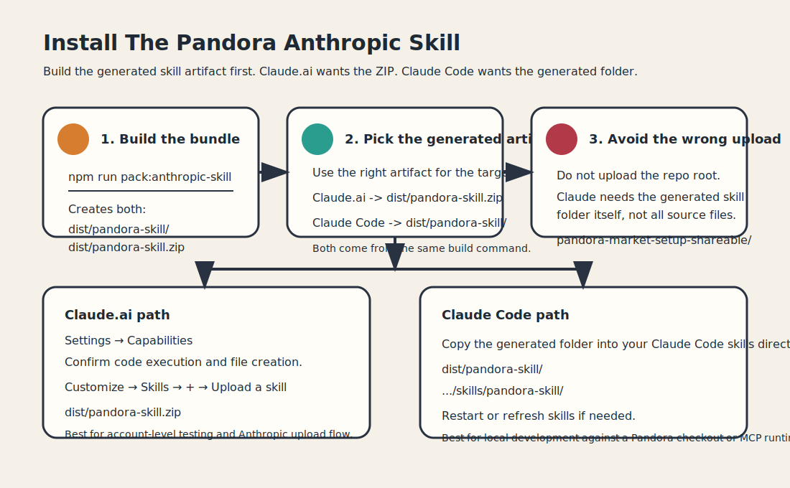
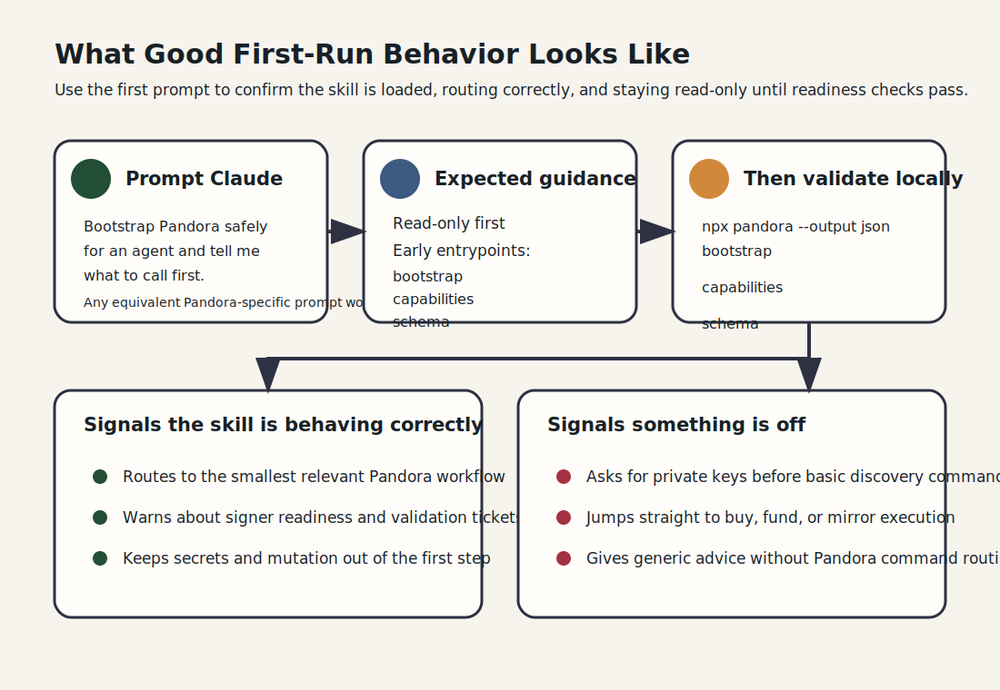

# Install The Anthropic Skill

Use this guide when you want to install the Pandora Anthropic skill in Claude.ai or Claude Code.

This guide is about the skill artifact, not the repo root.



- Build the skill artifact with `npm run pack:anthropic-skill`.
- Upload `dist/pandora-skill.zip` in Claude.ai.
- Install `dist/pandora-skill/` in Claude Code.
- Do **not** upload the repo root directly as a skill.
- Keep Pandora itself installed separately when you want live CLI or MCP access.

The visual above is the shortest install rule: build the generated bundle, install the generated bundle, and keep the repository root out of the upload path.

## What The Skill Does

The Anthropic skill teaches Claude how to use Pandora safely and consistently.

It is for:

- safe bootstrap and read-only discovery
- market quote and workflow routing
- mirror planning and validation-first execution guidance
- policy/profile readiness checks
- local MCP versus hosted HTTP MCP decisions

It is not a replacement for the Pandora CLI or MCP runtime. Think of it this way:

- Pandora CLI / MCP: the executable tools and live contract surface
- Anthropic skill: the workflow guidance, best practices, and routing layer

## Before You Install

Have these ready:

1. A generated Anthropic skill zip for Claude.ai or generated skill folder for Claude Code from `npm run pack:anthropic-skill`
2. A Pandora runtime only if you want live bootstrap, MCP, or execution
3. A read-only-first plan for any workflow that could later touch secrets or signer material

If you only want to review the skill, you do not need live secrets.

## Install In Claude.ai

1. Open Claude.ai.
2. Go to `Settings`.
3. Open `Capabilities` and confirm `Code execution and file creation` is enabled.
4. Open `Customize`.
5. Open `Skills`.
6. Click `+`, then choose `Upload a skill`.
7. Select `dist/pandora-skill.zip`.
8. Confirm the skill appears in your Skills list and is enabled.

Claude.ai currently expects the generated zip, not the unpacked folder.

After upload, start with read-only prompts first.

## Install In Claude Code

Place the generated Anthropic skill folder in your Claude Code skills directory.

Recommended source:

- `dist/pandora-skill/`

If your local setup uses a custom shared skills directory, use that directory instead of copying the repo root. The important part is that Claude Code sees the generated skill folder itself, not the full repository.

After installation, restart Claude Code or refresh skills if your environment requires it.

## Quick Test Prompts

Use these prompts to confirm the skill is loading and giving the right kind of guidance:

- `Bootstrap Pandora safely for an agent and tell me what to call first.`
- `I want to inspect Pandora capabilities without using secrets.`
- `Help me quote a Pandora market before I buy.`
- `Plan a mirror market from Polymarket and tell me the safe validation steps.`
- `Check whether my Pandora signer profile is ready for live execution.`
- `I need local MCP versus hosted HTTP MCP guidance for Pandora.`



Good first-run behavior should include:

- read-only-first guidance
- `bootstrap`, `capabilities`, and `schema` as early entrypoints
- warnings about validation tickets, resolution sources, and signer readiness
- routing to the smallest relevant Pandora workflow doc or command family

Use the visual as a quick smell test: if Claude skips straight to secrets or execution, the install may be wrong or the prompt may be too broad.

## Safe First Workflow

If you want to test the installed skill against a real Pandora checkout, use this order:

```bash
npm install
npx pandora --output json bootstrap
npx pandora --output json capabilities
npx pandora --output json schema
npx pandora --output json policy list
npx pandora --output json profile list
```

That sequence validates the read-only contract surface before you even think about mutation, funding, or private keys.

## If You Also Want MCP

The Anthropic skill and Pandora MCP are complementary:

- use the skill when you want Claude to know the safe workflow
- use MCP when you want Claude to call live Pandora tools

Recommended posture:

- local stdio MCP for self-custody, same-machine workflows
- hosted read-only HTTP MCP for shared planning, discovery, and audit
- signer material only on the runtime that actually needs to execute

See [`agent-quickstart.md`](./agent-quickstart.md) for the detailed MCP operating models.

## Build And Validate The Bundle

Use these commands before installation or release:

```bash
npm run pack:anthropic-skill
npm run check:anthropic-skill
```

If you are validating trigger quality or release readiness, continue with:

- [`anthropic-skill-evals.md`](./anthropic-skill-evals.md)

## Troubleshooting

### The skill uploaded, but Claude does not seem to use it

- Re-check that you uploaded the generated Anthropic skill bundle, not the repo root.
- Try one of the quick test prompts above instead of a broad generic request.
- Use a Pandora-specific request such as `bootstrap Pandora`, `quote a market`, or `plan a mirror market`.

### The skill loads, but Pandora commands fail

- The issue is likely your Pandora runtime, not the skill itself.
- Test read-only Pandora commands first.
- If using MCP, confirm the runtime is connected and still read-only unless you intentionally expanded scope.

### Claude asks for secrets too early

That is not the intended workflow. Start with:

- `bootstrap`
- `capabilities`
- `schema`
- `policy list`
- `profile list`

Only add secrets after the exact workflow requires them and the relevant readiness checks pass.

## Related Docs

- Main repo landing page: [`../../README.md`](../../README.md)
- Shareable package guide: [`../../README_FOR_SHARING.md`](../../README_FOR_SHARING.md)
- Agent bootstrap and MCP operating models: [`./agent-quickstart.md`](./agent-quickstart.md)
- Command routing: [`./command-reference.md`](./command-reference.md)
- Mirror planning and validation: [`./mirror-operations.md`](./mirror-operations.md)
