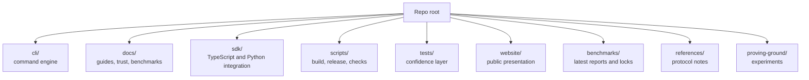

# Pandora Repo Map

This page explains the folder layout in plain English.

## What each area owns

### `cli/`

This is the working engine room. It holds the command implementation and most of the runtime behavior.

### `docs/`

This is the reading layer. It explains setup, workflows, trust posture, benchmark meaning, and the proving-ground research lane.

### `sdk/`

This is the integration layer for builders who want Pandora inside another app.

### `scripts/`

This is the factory line for packaging, verification, contract generation, release prep, and checks.

### `tests/`

This is the confidence layer. It shows how the repo proves that important flows still work.

### `website/`

This is the public-facing explanation layer.

### `benchmarks/`

This stores benchmark inputs, latest outputs, and lock files that pin reference results.

### `references/`

This holds protocol and checklist notes that support the main guides.

### `proving-ground/`

This is the experimentation lane for research-style runs and scenario work. Generated local reports live here too, but they should stay disposable.

## Simple reading path

If someone is new:

1. `README.md`
2. `docs/skills/setup-and-onboarding.md`
3. `docs/skills/capabilities.md`
4. `docs/skills/agent-interfaces.md`
5. `docs/proving-ground/README.md`
6. `docs/trust/release-verification.md`

## Related pages

- [Overview](../overview.md)
- [Current repo snapshot](../sources/current-repo-snapshot.md)
- [Release and quality loop](../workflows/release-and-quality-loop.md)
