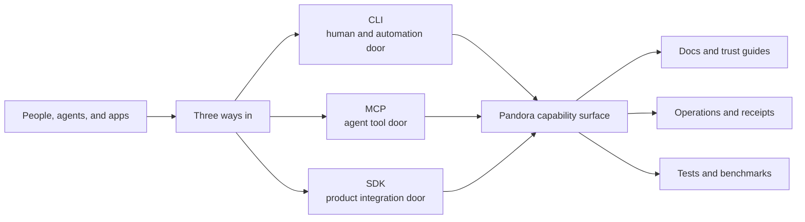

# Pandora Overview

Pandora is one market engine with three front doors:

- a command line for people and operations (`CLI`)
- a tool channel for agents (`MCP`)
- software libraries for products (`SDK`)

The important idea is simple: one core capability surface is packaged in different shapes so different users can reach the same system without learning a completely different world each time.

## What Pandora seems to optimize for

- safe read-only discovery first
- explicit readiness checks before live actions
- one shared contract for humans, agents, and apps
- trust signals around releases, support, and security
- a split between small release-proof evidence and larger research evidence

## Mental model

Think of Pandora as a trading and market operations workshop.

- The `CLI` is the operator console.
- The `MCP` surface is the tool belt for AI workers.
- The `SDK` is the way another product can plug Pandora into its own system.
- The docs and trust pages are the operating manual and safety board.

## Where the truth lives

- Human and workflow guidance: `README.md`, `docs/skills/`
- Machine and agent contract details: `docs/skills/agent-interfaces.md`, `docs/skills/capabilities.md`
- Packaging and release behavior: `package.json`, `scripts/`, `docs/trust/`
- Evidence model and research lane: `docs/benchmarks/`, `docs/proving-ground/`, `proving-ground/`
- Integration surfaces: `sdk/`

## Best next pages

- [Repo map](./maps/repo-map.md)
- [Evidence lanes](./workflows/evidence-lanes.md)
- [CLI surface](./surfaces/cli.md)
- [Agent and MCP surface](./surfaces/agent-and-mcp.md)
- [SDK surface](./surfaces/sdk.md)
- [Release and quality loop](./workflows/release-and-quality-loop.md)
