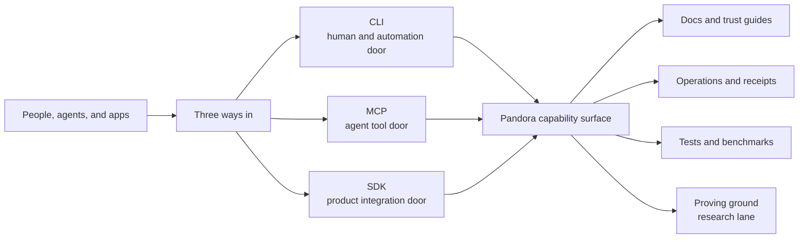

# Pandora Overview

Pandora is one market engine with three front doors:

- a command line for people and operations (`CLI`)
- a tool channel for agents (`MCP`)
- software libraries for products (`SDK`)

The important idea is simple: one core capability surface is packaged in different shapes so different users can reach the same system without learning a completely different world each time.

```mermaid
flowchart LR
  Users["People, agents, and apps"] --> Doors["Three ways in"]
  Doors --> CLI["CLI<br/>human and automation door"]
  Doors --> MCP["MCP<br/>agent tool door"]
  Doors --> SDK["SDK<br/>product integration door"]
  CLI --> Core["Pandora capability surface"]
  MCP --> Core
  SDK --> Core
  Core --> Docs["Docs and trust guides"]
  Core --> Ops["Operations and receipts"]
  Core --> Checks["Tests and benchmarks"]
  Core --> Research["Proving ground<br/>research lane"]
```

## What Pandora seems to optimize for

- safe read-only discovery first
- explicit readiness checks before live actions
- one shared contract for humans, agents, and apps
- trust signals around releases, support, and security
- a split between small release-proof evidence and larger research evidence
- separate mirror operating modes so setup matches the real job
- a research lane that can improve the repo in isolated rooms before a human promotes anything

## Mental model

Think of Pandora as a trading and market operations workshop.

- The `CLI` is the operator console.
- The `MCP` surface is the tool belt for AI workers.
- The `SDK` is the way another product can plug Pandora into its own system.
- The docs and trust pages are the operating manual and safety board.
- The mirror layer now has three clear shapes:
  - `mirror sync --no-hedge` for Pandora-only mirroring
  - `mirror hedge` for Polymarket-only hedge management
  - plain `mirror sync` for the hybrid loop
- The proving ground now also includes a reusable overnight improvement path, not just trading simulations.

## Research lane in simple terms

Pandora now has a more disciplined overnight loop.

What we need to have is a way to test one improvement at a time in separate rooms `(isolated worktrees)` so the morning review is calm instead of messy.

```mermaid
flowchart LR
  Goal["Clear goal"] --> Rooms["Split work into separate rooms"]
  Rooms --> Worker["One fresh worker tries one change"]
  Worker --> Review["Automated review gate"]
  Review --> Tests["Local checks and proofs"]
  Tests --> Packet["Receipt + handoff packet"]
  Packet --> Human["Morning human decision"]
```

This matters because the repo is no longer just documenting a research sandbox.
It now also documents a reusable overnight improvement engine.

## Where the truth lives

- Human and workflow guidance: `README.md`, `docs/skills/`
- Machine and agent contract details: `docs/skills/agent-interfaces.md`, `docs/skills/capabilities.md`
- Packaging and release behavior: `package.json`, `scripts/`, `docs/trust/`
- Evidence model and research lane: `docs/benchmarks/`, `docs/proving-ground/`, `proving-ground/`
- Integration surfaces: `sdk/`
- Goal-first setup and mirror runbooks: `docs/skills/setup-and-onboarding.md`, `docs/skills/mirror-operations.md`

## Best next pages

- [Repo map](./maps/repo-map.md)
- [Evidence lanes](./workflows/evidence-lanes.md)
- [Mirror modes and onboarding](./workflows/mirror-modes-and-onboarding.md)
- [Overnight autoresearch](./workflows/overnight-autoresearch.md)
- [CLI surface](./surfaces/cli.md)
- [Agent and MCP surface](./surfaces/agent-and-mcp.md)
- [SDK surface](./surfaces/sdk.md)
- [Release and quality loop](./workflows/release-and-quality-loop.md)
