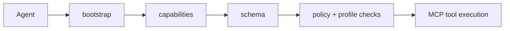

# Agent And MCP Surface

This is the door for AI workers. It turns Pandora into tools an agent can inspect and call.

## Core idea

An agent should not guess what Pandora can do. It should ask Pandora for the live contract first.

That is why the recommended order starts with:

- `bootstrap`
- `capabilities`
- `schema`
- `policy list`
- `profile list`

## Two operating shapes

### Local agent path

Use this when the agent runs on the same machine as Pandora. It is the simpler and safer path for self-managed execution (`pandora mcp`).

### Remote gateway path

Use this when you want a hosted tool endpoint for outside agents (`pandora mcp http`). This path is intentionally scope-driven, so access can stay narrow.

## Why this matters

Pandora treats the machine contract as a first-class product, not as a side effect of the human docs.

That shows up in:

- machine-readable schema
- scope-aware auth
- readiness metadata
- operation receipts and verification

## Important source files

- `SKILL.md`
- `docs/skills/agent-quickstart.md`
- `docs/skills/agent-interfaces.md`
- `docs/skills/policy-profiles.md`

## Simple explanation

If someone says, "I need my AI agent to use Pandora safely" (agent integration), this is the door they use.

## Related pages

- [CLI surface](./cli.md)
- [SDK surface](./sdk.md)
- [Overview](../overview.md)
