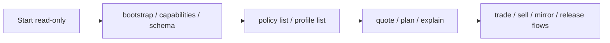

# CLI Surface

The command line is the human and automation door. It is the fastest way to inspect the system, run checks, and execute workflows from a terminal or CI job.

## Core idea

Pandora keeps pushing users toward a safer order:

1. discover first
2. check readiness
3. quote or plan
4. execute only when the path is clear

That means the `CLI` is not just a bag of commands. It is also the guardrail path.

## Main jobs this surface handles

- inspect what Pandora can do
- understand command contracts
- check policy and signer readiness
- run market, mirror, portfolio, and release workflows
- support automation and CI

## Important source files

- `README.md`
- `docs/skills/capabilities.md`
- `docs/skills/command-reference.md`
- `docs/skills/trading-workflows.md`
- `docs/skills/mirror-operations.md`

## Simple explanation

If someone says, "I need to run Pandora myself" (terminal workflow), this is the door they use.

## Related pages

- [Overview](../overview.md)
- [Agent and MCP surface](./agent-and-mcp.md)
- [Release and quality loop](../workflows/release-and-quality-loop.md)
