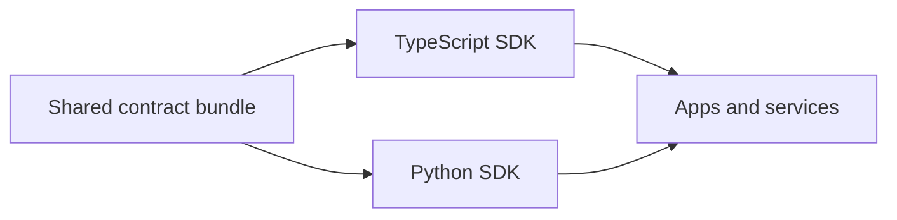

# SDK Surface

The SDK is the builder door. It is for teams that want Pandora inside another product instead of calling it manually.

## Core idea

Pandora ships the same contract in reusable package form for multiple languages.

Today the main builder paths are:

- TypeScript (`sdk/typescript`)
- Python (`sdk/python`)
- shared generated contract data (`sdk/generated`)

## What this unlocks

- product integrations
- custom wrappers
- internal platforms
- generated clients based on the same live contract surface

## Important source files

- `sdk/typescript/README.md`
- `sdk/python/README.md`
- `sdk/generated/`
- `docs/skills/agent-interfaces.md`
- `package.json`

## Simple explanation

If someone says, "We need Pandora inside our product" (application integration), this is the door they use.

## Related pages

- [Agent and MCP surface](./agent-and-mcp.md)
- [Repo map](../maps/repo-map.md)
- [Current repo snapshot](../sources/current-repo-snapshot.md)
