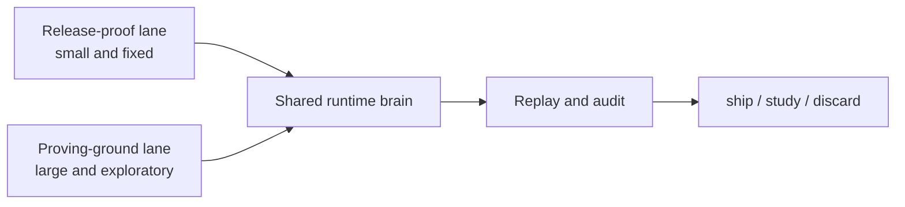

# Evidence Lanes

Pandora now uses two different evidence lanes for two different jobs.

## Release-proof lane

This is the small exam that proves the outside contract is still honest.

- stored and published under `core`
- also reachable through the public alias `surface-core`
- meant to stay small, fixed, and easy to audit
- used by release gating

## Proving-ground lane

This is the larger sandbox for long-running mirror, hedge, replay, and strategy work.

- lives under `proving-ground/`
- explained in `docs/proving-ground/README.md`
- writes generated local run output under `proving-ground/reports/`
- is useful for research, not as a direct release gate

## Why the split matters

One lane proves the public shell still matches the promise.
The other lane helps the team learn how the trading brain behaves under pressure over time.

Keeping them separate avoids a common mistake:

- making the release gate too large and noisy
- pretending exploratory simulations are the same thing as shipped proof

## Related pages

- [Release and quality loop](./release-and-quality-loop.md)
- [Overview](../overview.md)
- [Current repo snapshot](../sources/current-repo-snapshot.md)
