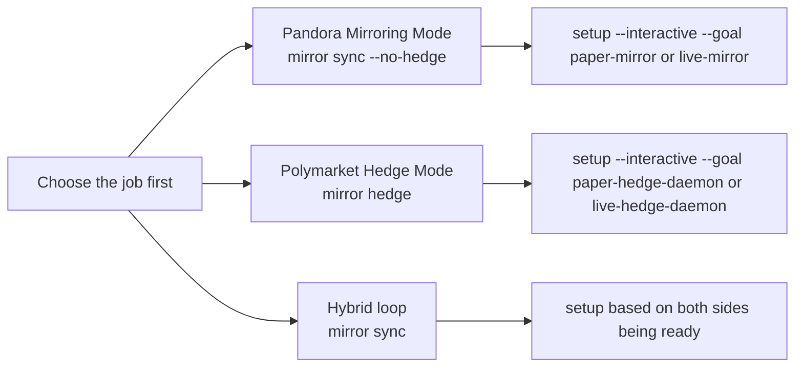

# Mirror Modes And Onboarding

Pandora now explains mirror work as three different jobs instead of one blurry flow.

That matters because setup should ask for different things depending on the job.

## The three jobs in plain English

- Pandora Mirroring Mode:
  - keep the Pandora market aligned to Polymarket
  - do not place Polymarket hedge trades
  - technical shape: `mirror sync --no-hedge`
- Polymarket Hedge Mode:
  - manage the hedge inventory on Polymarket for an existing mirror pair
  - technical shape: `mirror hedge`
- Hybrid loop:
  - rebalance Pandora and hedge Polymarket in one operational loop
  - technical shape: plain `mirror sync`

## Why the onboarding changed

Pandora now starts by asking what the user wants to achieve (goal selection), then asks only for the inputs that match that lane.

That means:

- read-only exploration can stay read-only
- mirror planning can collect source-market and close-time inputs
- hedge-daemon setup can focus on wallet whitelist, funder wallet, API keys, and host bundle needs

## Goal map

| Goal | Best used for | What Pandora focuses on |
| --- | --- | --- |
| `explore` | Safe discovery only | docs, bootstrap, and validation |
| `deploy` | Creating a Pandora market | signer, chain, and deployment checks |
| `paper-mirror` | mirror planning without live hedging | Pandora setup plus Polymarket discovery |
| `live-mirror` | live Pandora repricing | signer, connectivity, and provider readiness |
| `paper-hedge-daemon` | paper hedge daemon on an existing pair | whitelist, hedge policy, and host bundle prep |
| `live-hedge-daemon` | live hedge daemon on an existing pair | signer, funder, API keys, hedge policy, and host bundle prep |
| `hosted-gateway` | remote control-plane host | host deployment and connectivity |

## Operator logic

Use this order:

1. Choose the real operating mode.
2. Run setup for that mode.
3. Stay read-only until the runtime says the exact lane is ready.
4. For live mirror deployment, validate the exact payload before execute mode.

## Important guardrails

- `mirror plan|deploy|go` use a sports-aware close time suggestion, not a generic `+1h`.
- Live mirror deployment still needs at least two public resolution URLs from different hosts.
- `mirror hedge` now tracks sell-retry health more explicitly, so operators can spot both-side inventory lockups earlier.

## Related pages

- [CLI surface](../surfaces/cli.md)
- [Evidence lanes](./evidence-lanes.md)
- [Release and quality loop](./release-and-quality-loop.md)
- [Overview](../overview.md)
