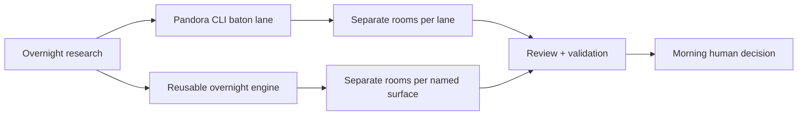
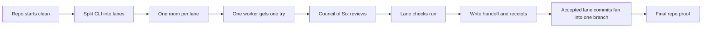
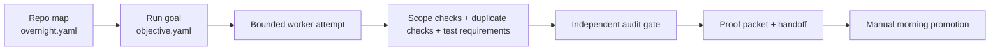

# Overnight Autoresearch

This page explains the new overnight improvement lane in plain English.

What we need to have is one machine that can explore safe repo improvements overnight `(objective-driven improvement engine)` without turning the repo into chaos by morning.

## Big picture

Pandora now has two closely related research loops inside the proving ground:

- a Pandora-shaped relay race for CLI improvements `(CLI baton system)`
- a more reusable overnight engine that can be pointed at named repo surfaces `(adapter + objective engine)`

## The CLI baton lane

Think of this as a relay race.

One worker enters one room, tries one improvement, gets reviewed, writes down what happened, and leaves.
Then the next fresh worker picks up from the written handoff instead of carrying stale memory from hours ago.

### Why this shape exists

The repo is trying to avoid a common failure:

- one long-running worker keeps stale context
- the quality of ideas drops
- the operator wakes up to noise instead of evidence

What we need to have is fresh judgment per attempt `(single-attempt worker epoch)`, not one tired worker dragging the whole night along.

### Main operator doors

- `npm run proving-ground:autoresearch:cli:baton`
- `npm run proving-ground:autoresearch:cli:baton:validate`

The thin script files in `scripts/` are now mostly public doors.
They hand control to the fuller implementation under `proving-ground/autoresearch/scripts/`.

## The reusable overnight engine

This second path is more generic.

Instead of thinking in Pandora CLI lanes only, it thinks in:

- what parts of the repo are allowed to change `(surface map in overnight.yaml)`
- what exact goal tonight is trying to hit `(run objective in objective.yaml)`

### Why this matters

The baton lane is good for Pandora itself.
The overnight engine is the step toward something reusable in other repos.

What we need to have is a system that says:

"Here are the safe walls, here is tonight's goal, and here is the proof packet if the change deserves promotion."

That is the repo-adapter story `(portable adapter boundary)`.

## Safety model

Across both research loops, the same safety theme shows up:

- changes happen in isolated rooms `(worktrees)`
- proposals are reviewed before code is kept `(review gate)`
- tests and validation run before promotion `(local proof)`
- the final publish choice still belongs to a human `(manual promotion gate)`

The repo is deliberately not promising fully autonomous shipping.

## Where the code and docs live

- explainer docs: `docs/proving-ground/`
- runnable engine code: `proving-ground/autoresearch/`
- compatibility doors: `scripts/run_*.cjs`
- research receipts: `proving-ground/reports/` as local evidence, not durable truth

## Related pages

- [Evidence lanes](./evidence-lanes.md)
- [Release and quality loop](./release-and-quality-loop.md)
- [Overview](../overview.md)
- [Current repo snapshot](../sources/current-repo-snapshot.md)
