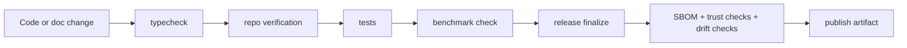

# Release And Quality Loop

This repo does not treat release as "zip it and hope". It treats release as a proof chain.

## Plain-English view

Before something ships, Pandora wants to prove four things:

- the code shape is valid
- the workflows still work
- the benchmark expectations still hold
- the trust bundle is present

## Signals seen in `package.json`

- `build` runs type checks
- `verify:repo` runs repo verification
- `verify:tests` runs tests
- `release:verify` combines repo checks, tests, and benchmark checks
- `release:finalize` rebuilds benchmark and software bill of materials outputs
- `release:publish` runs the full publish path with trust and drift checks

## Why this matters

This suggests Pandora is trying to be safe for external sharing, not just local hacking.

The trust documents under `docs/trust/` are not side notes. They are part of the release story.
The `proving-ground` is related, but separate. It is the larger research lane, not the release gate.

## Important source files

- `package.json`
- `docs/trust/release-verification.md`
- `docs/trust/security-model.md`
- `docs/trust/support-matrix.md`

## Related pages

- [Evidence lanes](./evidence-lanes.md)
- [Overview](../overview.md)
- [Repo map](../maps/repo-map.md)
- [Current repo snapshot](../sources/current-repo-snapshot.md)
