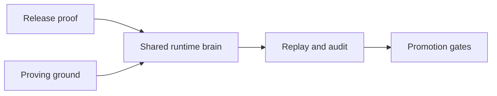

# Pandora Proving Ground

Pandora now has two separate jobs:

- `benchmarks/` proves the release contract stays honest `(surface proof)`
- `proving-ground/` runs long, stateful hedge experiments `(daemon-in-loop sandbox)`

The proving ground is where we study real trading behavior over time. It uses the same runtime brain as live Pandora, but the inputs are simulated and reproducible.



## What Lives Here

- `config/` holds reproducibility settings `(world lock, run defaults)`
- `lib/` holds loader and validation helpers for scenario families
- `scenarios/` holds deterministic family manifests
- `reports/` holds generated local run output `(report + handoff)` and should stay out of git

## Current Scope

The proving ground now has one production-shaped daemon gate:

- it uses the real CLI deploy surface in dry-run mode `(mirror deploy --dry-run)`
- it starts the real hedge daemon through the CLI `(mirror hedge start)`
- it injects a synthetic outside Pandora trade into the sandbox indexer feed
- it waits for the daemon to notice the trade and record the hedge signal timing `(trade seen time + hedge signal time + latency)`

This is still a narrow first lane, not the full long-run sandbox we want.
But it gives us one honest daemon rehearsal inside the validation gates.

## Autoresearch Loop

The proving ground now has a first research loop runner:

- it loads the sandbox family
- it runs quick and full validation gates
- it can ask MiniMax for one bounded improvement idea `(MiniMax-M2.7-highspeed)`
- it writes a report and handoff for every run
- it can apply only small structured edits with rollback when the git tree is clean

Run it like this:

```bash
node scripts/run_proving_ground_autoresearch.cjs --mode proposal
```

For a safe local proof without calling the model:

```bash
node scripts/run_proving_ground_autoresearch.cjs --mode baseline --skip-model
```
