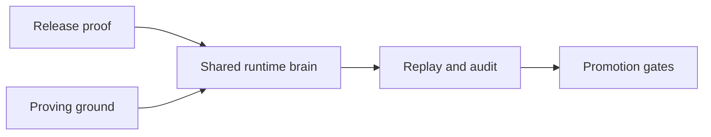
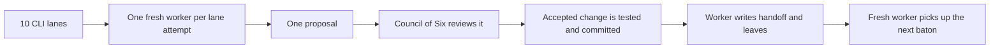

# Pandora Proving Ground

Pandora now has two separate jobs:

- `benchmarks/` proves the release contract stays honest `(surface proof)`
- `proving-ground/` runs long, stateful hedge experiments `(daemon-in-loop sandbox)`

The proving ground is where we study real trading behavior over time. It uses the same runtime brain as live Pandora, but the inputs are simulated and reproducible.

The newer auto-improvement engine now lives under `proving-ground/autoresearch/`. The old root paths remain as compatibility doors so older tests and operator commands keep working while Pandora itself stays publishable as a smaller package.



## What Lives Here

- `config/` holds reproducibility settings `(world lock, run defaults)`
- `lib/` holds loader and validation helpers for scenario families
- `scenarios/` holds deterministic family manifests
- `reports/` holds generated local run output `(report + handoff)` and should stay out of git

## Current Scope

The proving ground now has one production-shaped daemon gate:

- it uses the real CLI deploy surface in dry-run mode `(mirror deploy --dry-run)`
- it starts the real hedge daemon through the CLI `(mirror hedge start)`
- it injects a synthetic outside Pandora trade into the sandbox indexer feed
- it waits for the daemon to notice the trade and record the hedge signal timing `(trade seen time + hedge signal time + latency)`

This is still a narrow first lane, not the full long-run sandbox we want.
But it gives us one honest daemon rehearsal inside the validation gates.

## CLI Baton System

The CLI now has a second proving-ground lane for product improvement.

What we need to have is a relay race for CLI ideas `(baton control plane)`, not one long worker carrying stale context.



The baton runner now does this:

- creates one isolated worktree per CLI lane `(lane worktree)`
- gives each worker exactly one try `(single-attempt epoch)`
- writes a handoff after every attempt `(handoff receipt)`
- asks the Council of Six before changing code `(review gate)`
- promotes accepted lane commits into one integration branch `(integration fan-in)`
- runs the final repo validation before calling the batch ready `(promotion gate)`

Run the baton controller like this:

```bash
npm run proving-ground:autoresearch:cli:baton
```

Run the hybrid proof like this:

```bash
npm run proving-ground:autoresearch:cli:baton:validate
```

Operator commands:

```bash
node scripts/run_cli_baton_autoresearch.cjs inspect-batch --batch-dir <batchDir>
node scripts/run_cli_baton_autoresearch.cjs inspect-lane --batch-dir <batchDir> --lane lane-01
node scripts/run_cli_baton_autoresearch.cjs inspect-handoff --batch-dir <batchDir> --lane lane-01
node scripts/run_cli_baton_autoresearch.cjs pause --batch-dir <batchDir> --reason "operator check"
node scripts/run_cli_baton_autoresearch.cjs resume --batch-dir <batchDir>
node scripts/run_cli_baton_autoresearch.cjs requeue --batch-dir <batchDir> --lane lane-01
node scripts/run_cli_baton_autoresearch.cjs archive-lane --batch-dir <batchDir> --lane lane-01
node scripts/run_cli_baton_autoresearch.cjs promote --batch-dir <batchDir>
node scripts/run_cli_baton_autoresearch.cjs cleanup --batch-dir <batchDir>
```

## Objective-Driven Engine

What we need to have is one reusable overnight executor `(adapter + objective + proof engine)`, not just a Pandora-only swarm.

```mermaid
flowchart LR
A["Repo adapter (overnight.yaml)"] --> B["Objective contract (objective.yaml)"]
B --> C["One safe room per surface"]
C --> D["Worker makes one bounded proposal"]
D --> E["Engine checks scope, tests, and duplicates"]
E --> F["Local validation"]
F --> G["One independent audit gate"]
G --> H["Proof packet + handoff"]
H --> I["Manual morning promotion"]
```



The new generic engine now lives beside the baton runner:

```bash
node scripts/run_overnight_engine.cjs validate-adapter --adapter overnight.yaml --objective objective.yaml
node scripts/run_overnight_engine.cjs run --adapter overnight.yaml --objective objective.yaml
node scripts/run_overnight_engine.cjs inspect --batch-dir <batchDir>
node scripts/run_overnight_engine.cjs promote --batch-dir <batchDir>
node scripts/run_overnight_engine.cjs cleanup --batch-dir <batchDir>
```

This path is stricter than the older swarm loop:

- every run starts from a declared objective
- every mutable area is a named surface with invariants
- production code changes need matching test work
- accepted or failed ideas are remembered so the engine does not keep retrying the same thing
- publish to `main` remains manual
