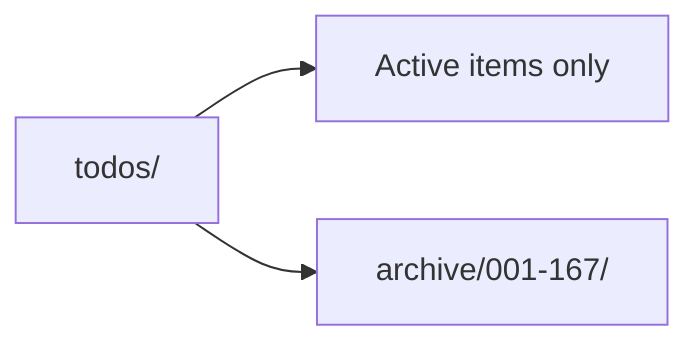

# Todo Backlog

The root `todos/` folder is the live backlog.

Policy:
- Keep only currently active work here.
- Move finished or parked items into `todos/archive/` so the hot path stays small.
- Preserve the original filenames and issue ids when archiving so history stays easy to trace.
- Reactivate an item by moving it back into `todos/` and updating its status if needed.

Current active items:
- `168-ready-p1-fix-mirror-pending-action-manual-review-latching-on-normal-live-starts.md`
- `169-ready-p1-fix-mirror-hedge-daemon-lifecycle.md`
